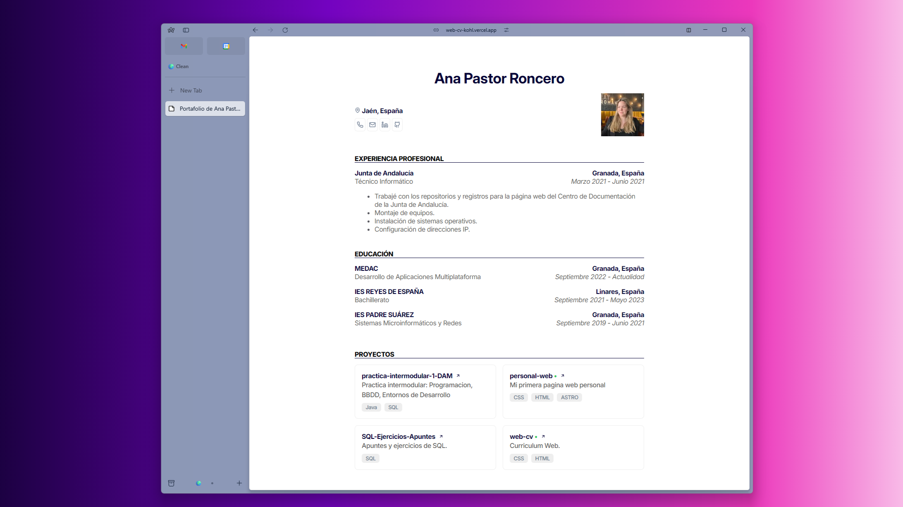

# Web CV

Basado en el diseño de <a href="https://github.com/BartoszJarocki/cv">Bartosz Jarocki</a>

=======

  

=======

## Herramientas

- Lucide-Icons
- uigradients

## 📃 License

Este proyecto está bajo la [MIT License](LICENSE.md).

## 🤝 Contribuciones

¡Gracias por tu interés en contribuir a este proyecto! cómo puedes hacerlo:
### Clonar o Hacer Fork del Repositorio
https://github.com/Anaroncero/web-cv.git

